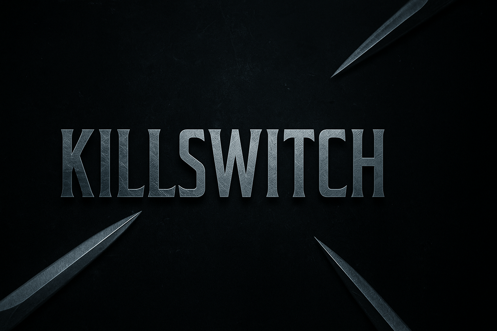

# KillSwitch 🔥

  

  
  
  
  

---

## 👋 About Me

I'm a **Java Programmer**, also learning **HTML** and **CSS**.

---

## 🚀 Skills & What I Do

- 🧩 **Minecraft Plugin Development** (Spigot, Paper)
- 🔧 **Server Setup & Configuration**
- 🌐 **Learning Web Development** (HTML, CSS, Java)

---

## 💬 Contact Me

- **Discord Username:** `killswitch_1191212`  
- **Discord Server:** [Join Here!](https://discord.gg/NagKCQdJjc)  
- **GitHub:** [KillSwitch](https://github.com/YourUsername)
